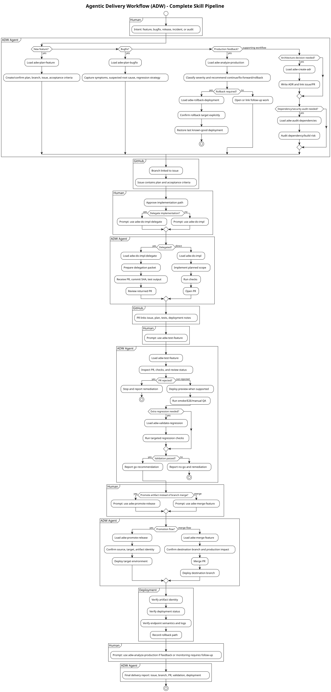

# agentic-delivery

Agentic Delivery Workflow (ADW) defines a Hermes-compatible skillset for moving software changes safely from intent to production.

```text
Plan → Branch → Issue → Implementation → PR → Review → Preview → Validation → Merge → Deployment
```

The PR is the central delivery artifact. The workflow prioritizes traceability, reviewability, deployment safety, clear operational communication, and small reliable iterations.

Chat/status updates may be localized separately. Repository artifacts are written in English.

## Repository Layout

- `SOUL.md` — ADW agent identity, tone, boundaries, and assumption policy.
- `skills/adw/*/SKILL.md` — Hermes-compatible workflow skills.
- `playbooks/` — shared operational procedures referenced by the skills.
- `templates/` — shared issue, PR, plan, report, and deployment templates.
- `adr/` — workflow architecture decisions.
- `docs/diagrams/` — PlantUML source and pre-rendered SVG diagrams.
- `tools/validate_adw_skills.py` — local validation for skill frontmatter and expected artifacts.

## Hermes-Compatible Skill Usage

Load ADW skills by name when working through a delivery lifecycle:

- `adw-plan-feature`
- `adw-plan-bugfix`
- `adw-do-impl`
- `adw-do-impl-delegate`
- `adw-test-feature`
- `adw-merge-feature`
- `adw-rollback-deployment`
- `adw-promote-release`
- `adw-validate-regression`
- `adw-create-adr`
- `adw-audit-dependencies`
- `adw-analyze-production`

The skills are designed as one pipeline. They reference shared playbooks/templates instead of duplicating them inside every skill directory.

## Complete Workflow Diagram

PlantUML source: [`docs/diagrams/adw-complete-workflow.puml`](docs/diagrams/adw-complete-workflow.puml)



If the `.puml` file changes, regenerate and commit the matching `.svg`:

```bash
docker run --rm -v "$PWD":/work -w /work plantuml/plantuml -tsvg docs/diagrams/adw-complete-workflow.puml
```

## Example Application: Invoice CSV Export

This example shows how a human can guide an ADW agent from plan to production using either minimal prompts or detailed prompts.

### Minimal Human Prompts

Use these when repository context is clear and the agent can infer safe candidates. The agent must confirm inferred assumptions before side effects.

1. Plan the feature:

```text
Use adw-plan-feature for invoice CSV export.
```

2. Implement the approved plan:

```text
Use adw-do-impl for the CSV export issue.
```

3. Validate PR and preview:

```text
Use adw-test-feature on the CSV export PR.
```

4. Merge and deploy after validation:

```text
Use adw-merge-feature for the validated CSV export PR.
```

5. Optional promotion when environments are separated by artifact promotion:

```text
Use adw-promote-release to promote the validated CSV export artifact from demo to production.
```

6. Optional production analysis after deployment:

```text
Use adw-analyze-production for the CSV export production deployment.
```

7. Emergency rollback if validation or production feedback fails:

```text
Use adw-rollback-deployment for the CSV export production deployment.
```

### Detailed Human Prompts

Use these when you want to reduce inference and make the delivery path explicit.

1. Plan:

```text
Use adw-plan-feature.
Repository: <owner>/<repo>
Base branch: main
Feature: invoice CSV export
Scope: add CSV export for invoice list using existing filters.
Out of scope: PDF export, invoice editing, permission model changes.
Acceptance criteria:
- Users can download filtered invoice lists as CSV.
- CSV columns are documented and stable.
- Existing invoice list behavior is unchanged.
- Tests cover export success and empty result behavior.
Create a feature branch and GitHub issue, then stop before implementation.
```

2. Optional architecture decision:

```text
Use adw-create-adr if CSV export introduces a new cross-service export pattern or external storage decision. Otherwise state why ADR is not needed.
```

3. Optional dependency/security audit:

```text
Use adw-audit-dependencies for any new CSV/export dependency before implementation. Prefer no new dependency if the platform standard library is sufficient.
```

4. Implementation:

```text
Use adw-do-impl.
Implement only the linked invoice CSV export plan on the current feature branch.
Run relevant unit/integration checks.
Open a PR targeting main using the shared PR template.
Do not merge or deploy.
```

5. Delegated implementation alternative:

```text
Use adw-do-impl-delegate.
Delegate the linked invoice CSV export plan to the approved sandbox flow.
Require the worker to return a PR URL, commit SHA, changed-file summary, and test output.
Review the returned PR before reporting acceptance.
```

6. Validation:

```text
Use adw-test-feature.
Validate the invoice CSV export PR.
Check review status, review if needed, deploy the feature branch to preview if supported, run smoke/E2E checks for CSV download, and report go/no-go.
```

7. Extra regression validation:

```text
Use adw-validate-regression.
Target: invoice CSV export PR and preview URL.
Checks: existing invoice list behavior, filtered exports, empty exports, and unauthorized access behavior.
Attach evidence to the validation report.
```

8. Merge and production deployment:

```text
Use adw-merge-feature.
PR: <PR URL or number>
Destination branch: main
Deployment target: production
Only proceed if review is approved, checks pass, preview validation is complete, and I explicitly confirm the production deployment.
```

9. Release promotion alternative:

```text
Use adw-promote-release.
Promote the exact validated invoice CSV export artifact from demo to production.
Preserve artifact identity and verify production after deployment.
```

10. Production analysis:

```text
Use adw-analyze-production.
Inspect production feedback for the invoice CSV export deployment.
Check the deployment artifact, logs, endpoint behavior, and user-visible CSV download path.
Recommend continue, fix-forward, or rollback.
```

11. Rollback:

```text
Use adw-rollback-deployment.
Environment: production
Rollback target: last known-good release before invoice CSV export
Create a follow-up bug issue with the root-cause hypothesis and evidence.
```

## Parameter Resolution Policy

Minimal prompts are allowed. The agent may infer safe values from current repository context, branch, issue, PR, deployment metadata, and ADW artifacts, but must ask for confirmation before acting on inferred assumptions.

The agent must ask for explicit human input when ambiguity affects production, data, security, destructive actions, merge targets, rollback targets, or secret handling.

## Validation

Run:

```bash
python3 tools/validate_adw_skills.py
git diff --check
```
