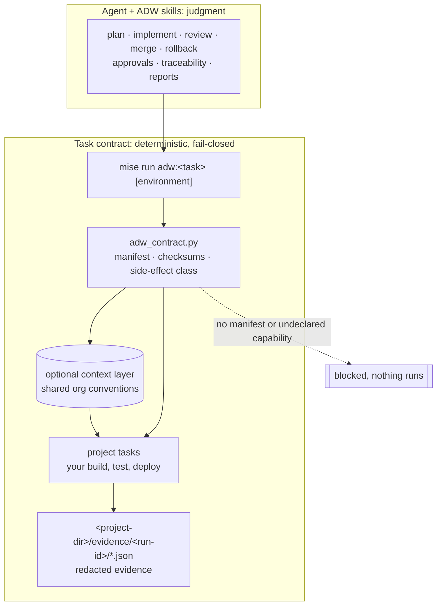

# Agentic Delivery Workflow (ADW)

**Agent skills and a fail-closed task contract that take a change from plan to verified deployment, the way a careful senior engineer would, and leave evidence you can check.**

[](https://github.com/smarterworkerai/agentic-delivery/actions/workflows/producer-quality.yml)
[](https://github.com/smarterworkerai/agentic-delivery/releases)
[](LICENSE)

Works with any agent that supports [Agent Skills](https://agentskills.io): Claude Code, Codex, Cursor, Gemini CLI, GitHub Copilot, Hermes Agent and others.

---

## Why

Coding agents are good at writing code and bad at delivering it. They improvise build commands, report "tests passed" when nothing ran, and happily push to production. ADW gives an agent a delivery discipline:

- **The PR is the unit of delivery.** Plan, branch, issue, PR, review, preview, merge and deploy stay linked.
- **Humans approve the risky steps.** Merge, production deploy, rollback, secrets and destructive work always need an explicit "yes". The agent does the rest.
- **No improvisation.** Build, test, deploy and verify run only through a versioned task contract (`mise run adw:*`). If the project doesn't declare a capability, ADW reports `blocked` instead of guessing.
- **Honest results.** `skipped` and `unsupported` are never reported as `passed`. Every task writes redacted JSON evidence.

## How it works


```mermaid
flowchart LR
    H((Human)) -->|intent| P["Plan<br/>branch · issue · acceptance criteria"]
    P --> I["Implement<br/>adw:verify:minimal"]
    I --> G1{{Approve PR route}}
    G1 --> R["Review + preview<br/>adw:deploy:apply · adw:test:e2e:fast"]
    R --> G2{{Approve merge}}
    G2 --> M[Merge]
    M --> G3{{Approve deploy target}}
    G3 --> D["Deploy + verify<br/>adw:validate-deployment"]
    D -. failure .-> RB[Rollback]
    classDef gate fill:#fff3cd,stroke:#b58900,color:#3d2e00;
    class G1,G2,G3 gate;
```

ADW has two halves with a hard boundary between them:


```mermaid
flowchart TB
    subgraph Judgment["Agent + ADW skills: judgment"]
        S["plan · implement · review · merge · rollback<br/>approvals · traceability · reports"]
    end
    subgraph Contract["Task contract: deterministic, fail-closed"]
        T["mise run adw:#lt;task#gt; [environment]"]
        V["adw_contract.py<br/>manifest · checksums · side-effect class"]
        C[("optional context layer<br/>shared org conventions")]
        PT["project tasks<br/>your build, test, deploy"]
        E["#lt;project-dir#gt;/evidence/#lt;run-id#gt;/*.json<br/>redacted evidence"]
    end
    S --> T --> V
    V --> C --> PT
    V --> PT
    PT --> E
    V -.->|no manifest or undeclared capability| B[["blocked, nothing runs"]]
```

- **Skills** decide *what* should happen and *when a human must decide*.
- **The contract** decides *how* it runs: 26 canonical tasks with fixed side-effect classes (`read-only`, `local-write`, `remote-write`) and exit classes (`0` ok, `1` failed, `20` blocked, `21` contract error). Each project implements the tasks it supports. Precedence: generic → optional context → project.

## Quickstart

### 1. Install the skills

| Your agent | Install |
|---|---|
| **Any Agent Skills client** | Download the latest [release](https://github.com/smarterworkerai/agentic-delivery/releases) archive, verify it against `SHA256SUMS`, and copy each skill directory under `skills/adw/` into your agent's skills directory (Claude Code: `~/.claude/skills/` or `<repo>/.claude/skills/`). |
| **Claude Code (plugin)** | `/plugin marketplace add smarterworkerai/agentic-delivery`, then `/plugin install agentic-delivery@agentic-delivery` |
| **Hermes Agent** | Use the pinned command from the [latest release notes](https://github.com/smarterworkerai/agentic-delivery/releases/latest). It includes the exact commit SHA and archive checksum; see [integrations/hermes](integrations/hermes/README.md). |

### 2. Adopt ADW in a repository

Ask your agent:

> Use adw-core to generate an ADW adapter for this repository.

It inspects the repo and proposes a **reviewable diff**, with nothing executed except `adw:check`:

```text
mise.toml                          # includes the generic task contract
.adw/adw-task-manifest.json        # which tasks you support, environments, verification graphs
.adw/ADW.md                     # short narrative policy for humans and agents
mise-helper/                       # your task implementations (existing scripts can be reused)
mise-helper/vendor/agentic-delivery/  # pinned, checksummed contract snapshot
```

Review it, commit it, then:

```bash
mise run adw:check        # validates manifest, sources, checksums, side-effect classes
mise run adw:describe     # prints capabilities and environments as JSON
```

### 3. Deliver a change

```text
Plan the feature "export to CSV".
Implement it.
Test PR #42 on the preview environment.
Merge PR #42.
```

The agent picks the matching skill, stops at every approval gate, and reports in a fixed format (status, completed, risks, next).

## Skills

<!-- skills:start -->
| Skill | Use it to | Human gate |
|---|---|---|
| `adw-core` | Loads ADW delivery rules, project adapter resolution, shared playbooks, and the fail-closed mise task contract. Use before another ADW skill, when adopting ADW in a repository, or when working with .adw/adw-task-manifest.json or the legacy .hermes project directory. | — |
| `adw-analyze-production` | Triages production feedback, logs, metrics, and incidents into continue, fix-forward, or rollback recommendations. Use when a deployment misbehaves, users report a live defect, or runtime evidence needs structured analysis. | Rollback or other remote mutation |
| `adw-audit-dependencies` | Audits dependency, build-tool, and toolchain changes for security, maintenance, compatibility, and release risk. Use for upgrade PRs, lockfile changes, supply-chain review, or dependency health checks. | — |
| `adw-chain` | Coordinates a bounded multi-stage ADW delivery sequence while preserving every quality and approval gate. Use when the user requests plan-through-merge, full rollout, or another explicit chain of delivery stages. | Confirm the exact chain proposal |
| `adw-create-adr` | Creates a reviewable Architecture Decision Record with context, options, decision, and consequences. Use for architectural, security-boundary, platform, or long-lived delivery decisions that need durable rationale. | — |
| `adw-do-impl` | Implements an approved plan, runs manifest-declared minimal verification, and prepares a reviewable commit or pull request. Use when coding a planned ADW change directly in a repository with an ADW task manifest. | Exact PR source and target route |
| `adw-do-impl-delegate` | Delegates an approved implementation through a backend-neutral brief and independently verifies the returned change. Use when another agent or worker should implement an ADW plan while the orchestrator retains delivery gates. | Exact PR source and target route |
| `adw-merge-feature` | Merges a validated pull request into an explicitly approved destination and deploys only when separately requested and gated. Use after review evidence is complete or when the user asks to merge or deliver an approved PR. | Merge and any deployment target |
| `adw-plan` | Plans a feature or bugfix as a reviewable delivery unit with branch, issue, acceptance criteria, verification, and rollback notes. Use when scoping a new capability, investigating a defect, or preparing non-trivial ADW work. | Plan approval when repository policy requires it |
| `adw-rollback-deployment` | Restores a failed deployment with the repository-declared rollback strategy and verifies the restored identity and health. Use for incident recovery or when an approved release must be rolled back safely. | Always before rollback |
| `adw-self-improve` | Persists an explicitly requested workflow improvement in the correct ADW, context, or project layer through a reviewable pull request. Use when the user asks the delivery system to learn, improve, or codify a recurring lesson. | Confirm the improvement proposal |
| `adw-test-feature` | Reviews and validates a pull request with local quality, preview deployment, smoke checks, and optional E2E evidence. Use before merge or when asked to test a feature branch, PR, or preview environment. | Preview deployment and each E2E run |
| `adw-validate-regression` | Runs targeted or broad regression checks against a pull request, branch, deployment, or release candidate and records honest evidence. Use for risk-based validation, regression investigation, or pre-release confidence. | Any remote-write or billable test |
<!-- skills:end -->

## Safety model

| Rule | Enforced by |
|---|---|
| No manifest, invalid manifest, or undeclared capability → `blocked` | `adw_contract.py` |
| Side-effect class is fixed per task name and cannot be overridden | contract + validator |
| `unsupported`/`skipped` never counts as `passed`; aggregates need fresh child evidence from the same run | contract |
| Contract snapshots are pinned to immutable commit SHAs and verified by SHA-256 | `adw:check`, `adw:context:check` |
| Merge, production, rollback, secrets, destructive changes, history rewrites need explicit approval | skills (and your agent's permission settings) |
| Secrets never appear in manifests, adapters, evidence or chat | skills + evidence redaction |

Full specification: [contract.md](skills/adw/adw-core/assets/mise/v2/contract.md).

## Context layers (optional)

An organization can publish a **context package** with shared, proven task implementations and conventions (for example, a common deploy backend). Projects pin it like the generic contract. Precedence stays generic → context → project, and `adw:context:check` reports when a pin is stale. The context never carries project facts or secrets.

## Versioning

- Semantic versioning for the whole package ([CHANGELOG](CHANGELOG.md)). The task contract is `v2`; breaking task, manifest, evidence or status changes require a new major version.
- Every release is a Git tag, a GitHub Release with checksums, and an entry in [`releases/adw-mise-v2.json`](releases/adw-mise-v2.json), the index that `adw:context:check` uses.

## Contributing

```bash
python3 tools/verify_producer.py      # unit, contract, distribution and skill-spec checks
```

See [CONTRIBUTING.md](CONTRIBUTING.md) for the Hermes Doctor check, how to add a skill, and the generated sections. Security reports: [SECURITY.md](SECURITY.md).

## License

MIT
