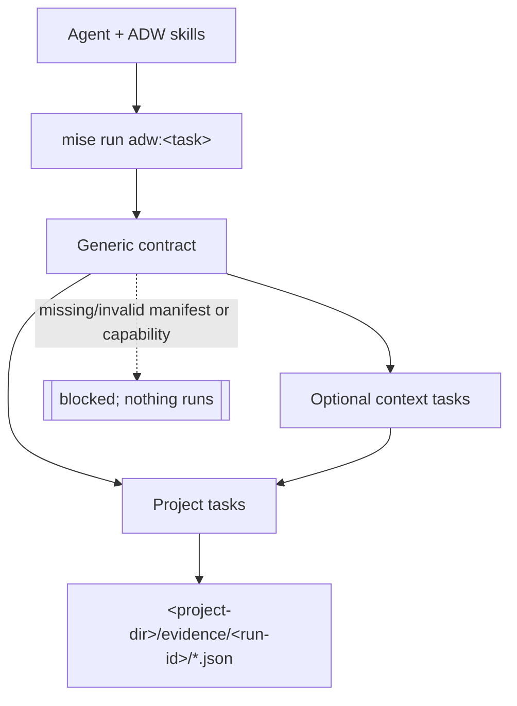

# Architecture

Agentic Delivery separates agent judgment from deterministic project operations. Skills decide what should happen, what evidence is sufficient, and where a human must decide. The mise contract executes only declared project capabilities and records redacted evidence.

```mermaid
flowchart LR
    H(("Human")) -->|"intent"| P["Plan"]
    P --> I["Implement"]
    I --> G1{{"Approve exact PR route"}}
    G1 --> R["Review and preview"]
    R --> G2{{"Approve merge"}}
    G2 --> M["Merge"]
    M --> G3{{"Approve deploy target"}}
    G3 --> D["Deploy and verify"]
    D -. "failure" .-> RB["Rollback"]
    classDef gate fill:#fff3cd,stroke:#b58900,color:#3d2e00;
    class G1,G2,G3 gate;
```



## Layers and boundary



The generic snapshot owns canonical task semantics, fixed side-effect classes, validation, and evidence. An optional context owns shared organization conventions and proven implementations. The project owns concrete commands, deployable units, environments, routes, health semantics, and secrets. Include precedence is generic → context → project.

Normal work uses vendored immutable snapshots and requires no network. `adw:context:check` reads the trusted release index, and `adw:context:sync` is the only explicit operation that downloads and replaces the generic snapshot.

## One task run

```mermaid
sequenceDiagram
    actor Agent
    participant Mise as "mise"
    participant Contract as "adw_contract.py"
    participant Project as "project hook"
    participant Evidence as "redacted evidence"
    Agent->>Mise: "mise run adw:check"
    Mise->>Contract: "validate manifest + catalog + checksums"
    alt "contract valid and capability supported"
        Agent->>Mise: "mise run adw:#lt;task#gt;"
        Mise->>Contract: "preflight"
        Contract->>Project: "execute declared hook"
        Project-->>Contract: "exit status"
        Contract->>Evidence: "atomic JSON write"
        Contract-->>Agent: "passed / failed / blocked"
    else "missing, conflicting, or invalid project contract"
        Contract->>Evidence: "bounded error evidence"
        Contract-->>Agent: "blocked or contract-error; no hook runs"
    end
```

## Project-directory resolution

The project adapter and manifest live together. New generic projects use `.adw/`; existing projects may retain `.hermes/`. A context package may require `.hermes/` until it adopts the neutral path. Exactly one directory may exist. Both is a contract error; neither blocks deterministic work and offers adapter generation.
